# Technologies used in the project: Java Swing JDBC MySQL

<table>
  <tr>
    <td align="center" >
      <b>JAVA</b>
    </td>
    <td align="center" style="padding-top: 15px;">
      
    </td>
  </tr>
 <tr>
    <td align="center" >
      <b>SQL</b>
    </td>
    <td align="center" style="padding-top: 15px;">
      
    </td>
  </tr>
</table>

In this project, 3 types of users are defined. Employee: It has the authority to add a hotel, add rooms to the hotel and price the rooms. User: Hotel Search, Adding New Reservation and Listing authorizations. Administrator: Has the authority to add and delete users.

# Login Screen

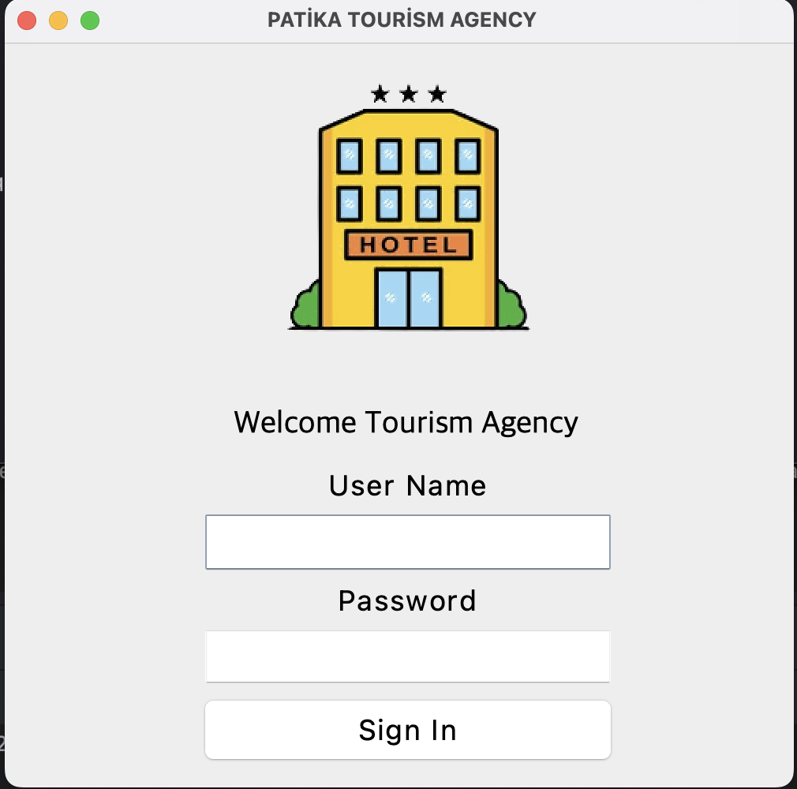

# Admin Screen

Administrator: Has the authority to add and delete users. This screen is designed to use their authorizations.

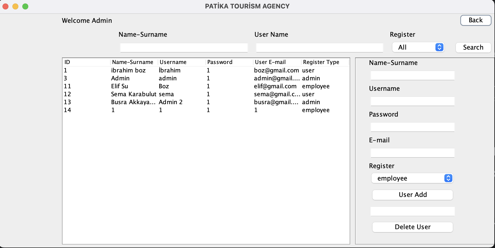

# Employee Screen

Employee: Has the authority to add a hotel, add rooms to the hotel and price the rooms.  This screen allows them to perform these operations. Photos have been added to make the examples more descriptive.

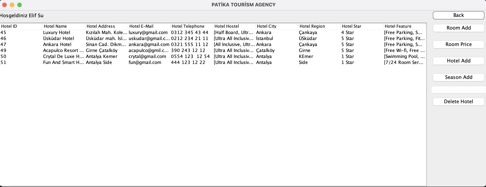

Hotel Addition Interface

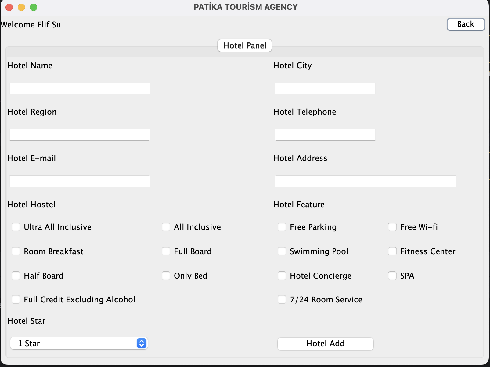

Room Addition Interface

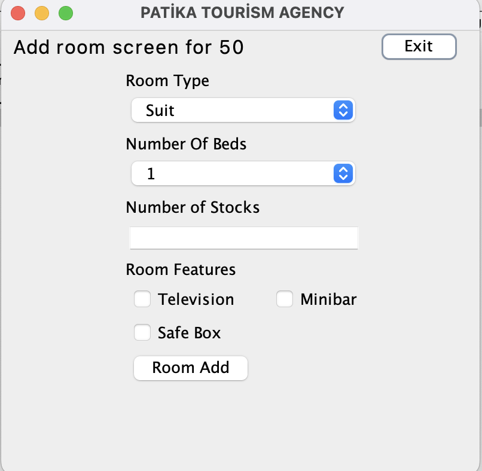

Interface for adding prices to hotels and hostels

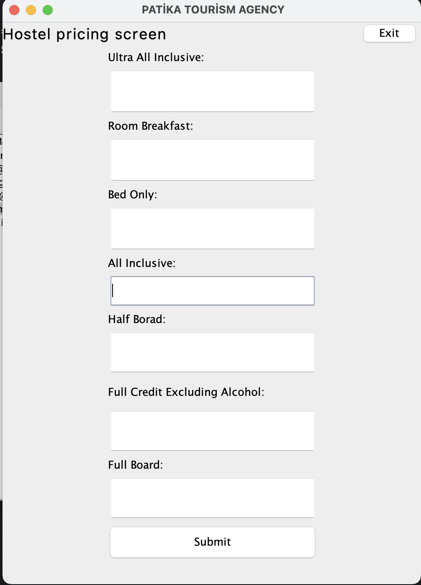

Season Addition Interface

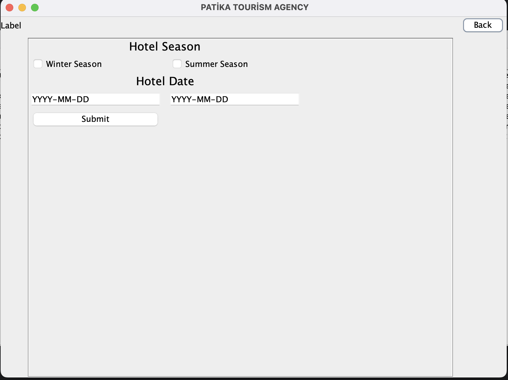

# User Screen

User: It has Hotel Search, New Reservation Adding and Listing authorizations.

Interface to list and process reservations made

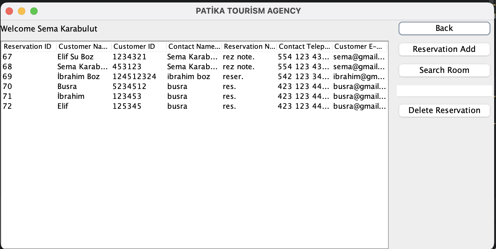

To list the rooms that are available.

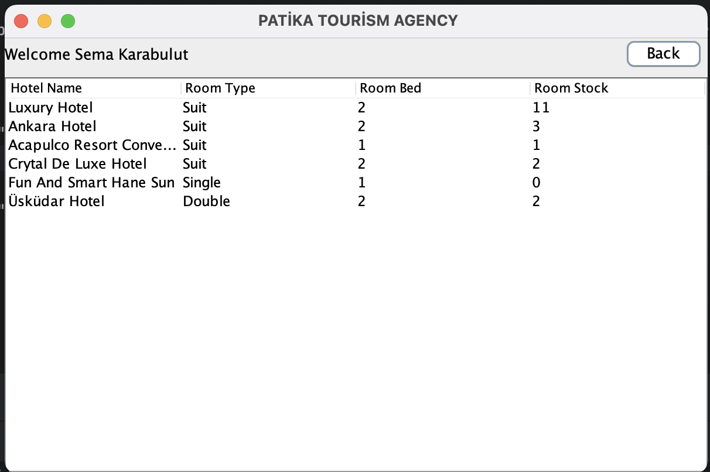

Interface to list and process reservations made

After the search process is completed, it brings the information of the relevant hotel to make a reservation.s

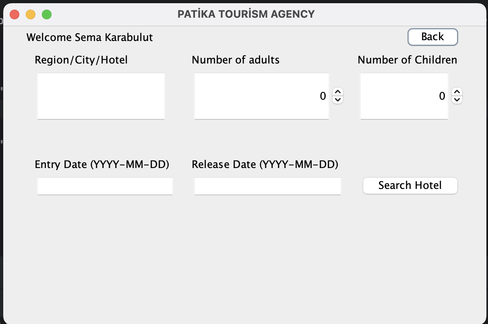

This interface is designed to make reservations after retrieving information after searching for available rooms

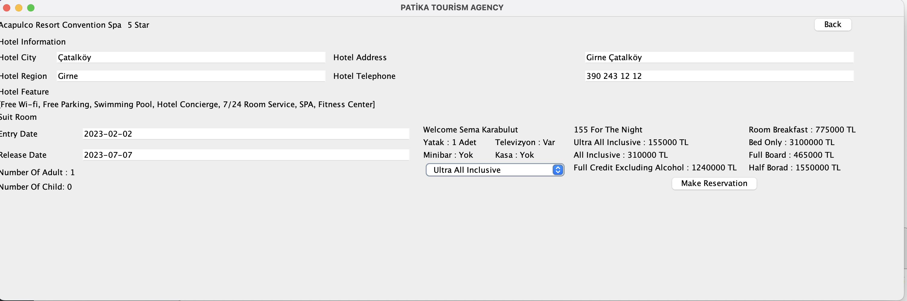